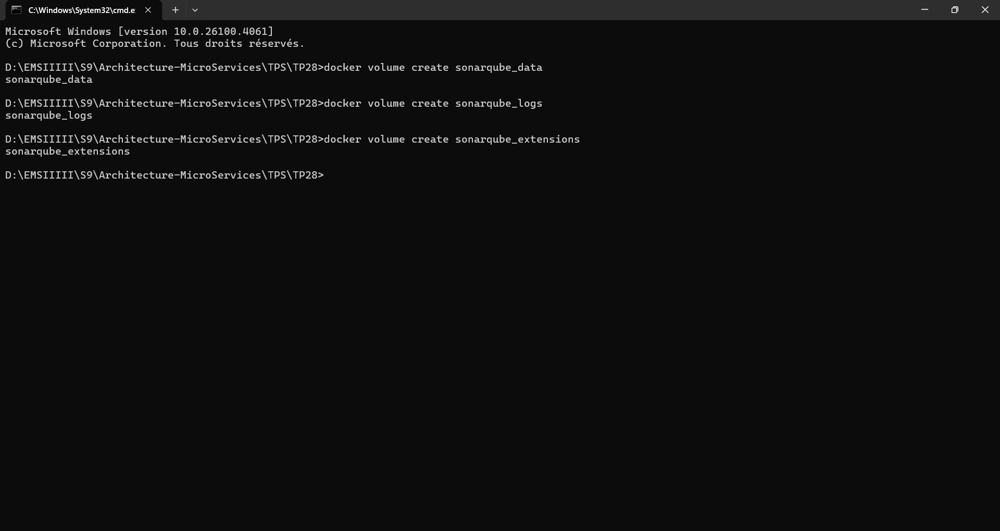
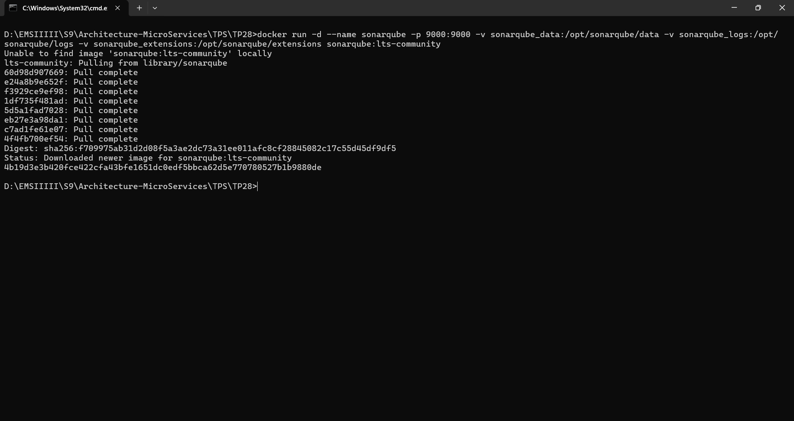
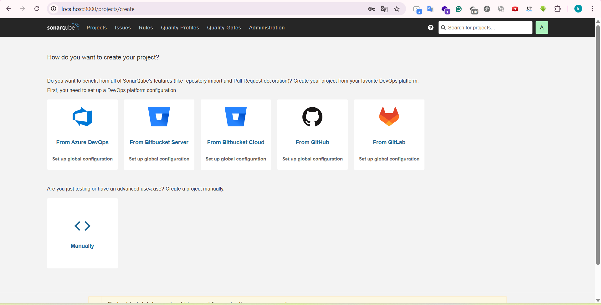
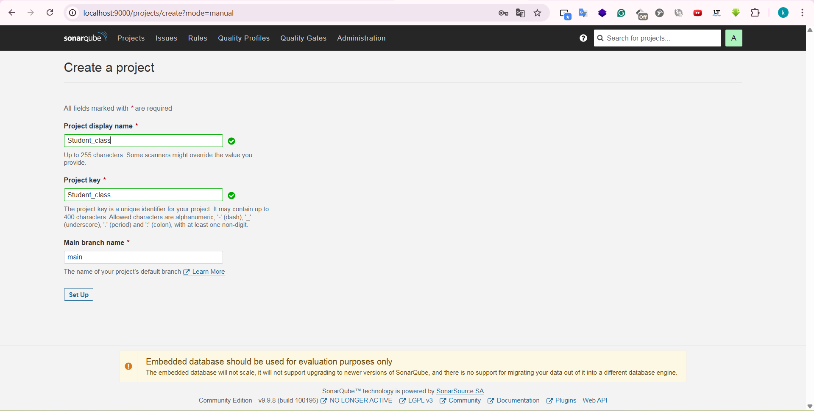
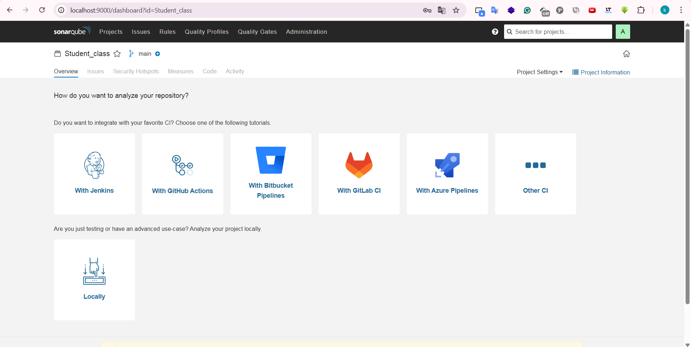
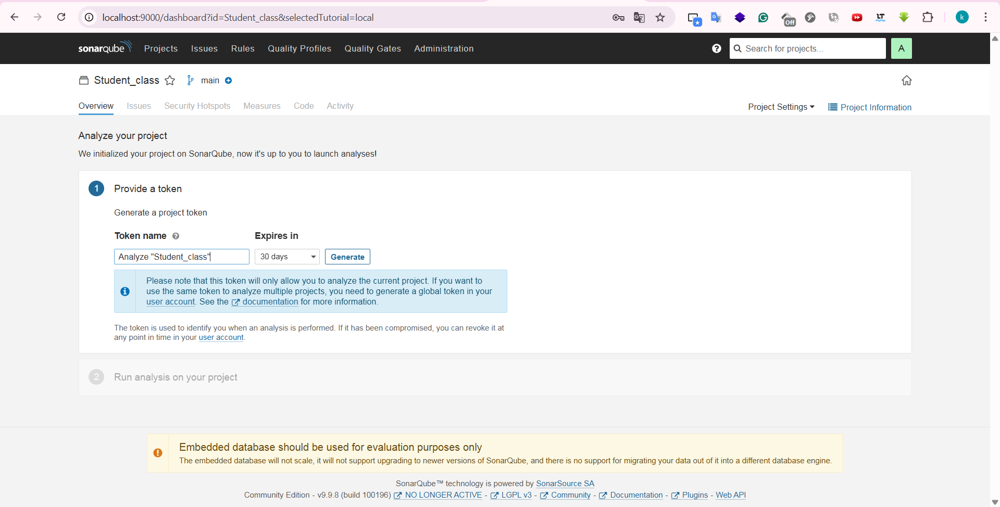
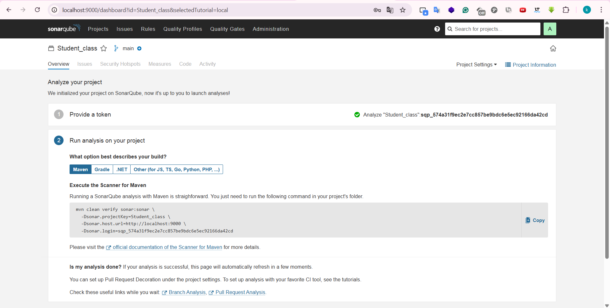

# TP 28 : SonarQube (local)

## 1. Démarrage SonarQube

## 2. Quality Gate

## 3. Création Projet (Manuel)

## 4. Mode Analyse Locale

## 5. Génération Token

## 6. Commande Maven

## 7. Résultats

